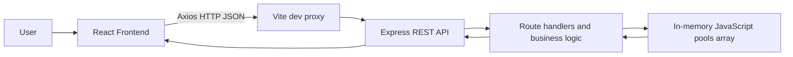
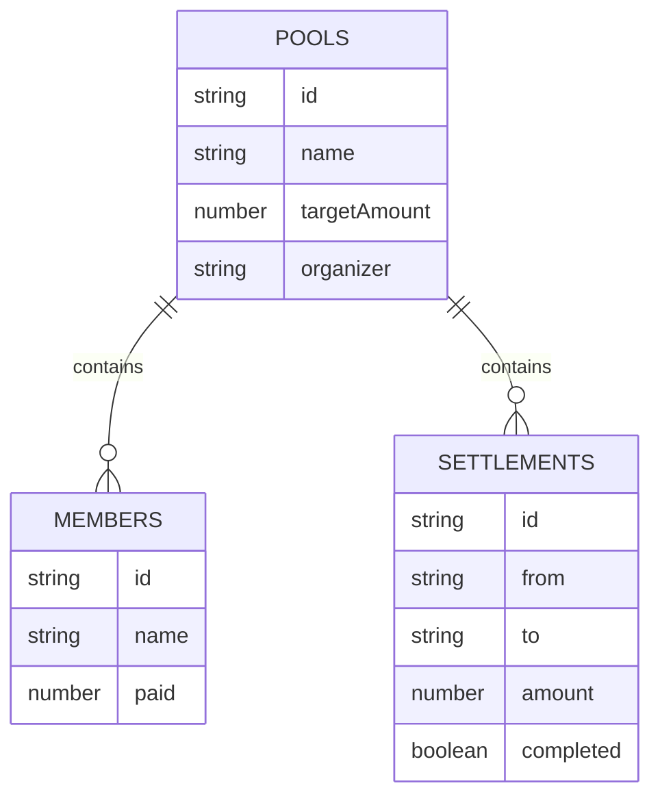
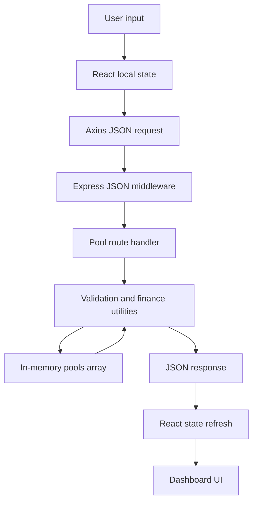
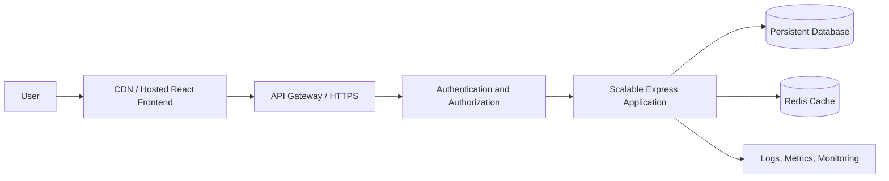

# FairShare: Technical Reasoning

This document describes the implementation currently present in the repository. The current MVP uses an Express API and in-memory JavaScript storage. It does not use MongoDB, Mongoose, MongoDB Atlas, authentication, payments, or a persistent database.

## 1. Project Overview

FairShare manages a shared expense pool for a group. An organizer creates a pool with a target amount, adds the people involved, records each person's current contribution, and sees how far each person is above or below an equal share. The application can then produce direct settlement payments between people who owe money and people who should receive money.

The problem is common in trips, shared events, club activities, and household expenses: the group knows the total target but does not want to calculate individual differences or decide who should pay whom manually. FairShare turns the group total and contribution amounts into a dashboard and a short list of suggested transfers.

Typical users are an organizer and the members of one group. For example, an organizer can create a “Weekend in Bali” pool with a target of ₹10,000, add the travelers, record contributions, inspect the “How much do I owe?” result, and mark suggested transfers as paid.

The main objectives are:

- Keep pool setup and contribution entry simple.
- Keep financial calculations on the backend.
- Show target, collected, remaining, percentage, equal share, and member balances.
- Make debtors and creditors easy to identify.
- Generate a small, understandable settlement plan.
- Support importing messy historical contribution rows and explain what was accepted, merged, duplicated, or rejected.
- Keep this MVP runnable without any external database service.

## 2. Requirements Analysis

| Requirement | How it is implemented | Relevant file(s) |
|---|---|---|
| Pool creation | `POST /api/pools` validates name, organizer, and a positive target, then creates a pool object with a generated UUID. | `server/routes/pools.js`, `server/store.js` |
| Member management | Members can be added, renamed, and deleted through REST endpoints. | `server/routes/pools.js`, `server/store.js` |
| Contributions/payments | Each member has one current `paid` amount. The payment endpoint replaces that amount; setting it to zero effectively clears it. | `server/routes/pools.js`, `server/store.js` |
| Equal share calculation | `targetAmount / members.length`, rounded to two decimal places. With zero members, equal share is zero. | `server/utils/finance.js` (`buildSummary`) |
| Total collected | Sums every member's `paid` value and rounds to cents. | `server/utils/finance.js` |
| Remaining amount | Uses `Math.max(targetAmount - totalCollected, 0)`, so over-collection never produces a negative remaining amount. | `server/utils/finance.js` |
| Member balances | Calculates `paid - equalShare` for every member. | `server/utils/finance.js` |
| “How much do I owe?” | A member selector reads the selected member's backend-calculated balance and labels the result as owes or should receive. | `client/src/App.jsx` (`Dashboard`) |
| Settlement generation | Filters negative balances into debtors and positive balances into creditors, then matches them with a two-pointer algorithm. | `server/utils/finance.js` (`createSettlements`), `server/routes/pools.js` |
| Settlement completion | Generated settlements receive IDs and `PATCH` toggles their `completed` field. | `server/store.js`, `server/routes/pools.js`, `client/src/App.jsx` |
| Validation | Backend checks non-empty names, positive pool target, non-negative payments, required import text, valid member/pool IDs, and valid import rows. Basic HTML constraints also exist in the pool form. | `server/routes/pools.js`, `server/utils/importContributions.js`, `client/src/App.jsx` |
| Error handling | Express returns JSON errors; the client shows backend messages where available and development request errors for pool creation. | `server/src.js`, `server/routes/pools.js`, `client/src/App.jsx` |
| Messy contribution import | Accepts pasted line-based rows, parses currency formats, removes duplicate normalized name/amount rows, merges name variants, and returns a detailed report. | `server/utils/importContributions.js`, `server/routes/pools.js`, `client/src/App.jsx` |
| Responsive dashboard | CSS media queries adapt the setup screen, dashboard grids, member rows, import form, and action controls for smaller screens. | `client/src/styles.css` |
| Health check | `GET /api/health` returns `{ "status": "ok" }`. | `server/src.js` |

## 3. Functional Workflow

### Create pool

1. The user enters a pool name, target amount, and organizer in the `Setup` component.
2. The browser's required fields and positive numeric minimum provide immediate basic feedback.
3. Axios sends `POST /api/pools` with `{ name, targetAmount, organizer }` to the relative `/api` base URL.
4. Vite proxies `/api` requests to the Express server during development.
5. Express parses JSON, validates the request, calls `createPool`, and stores the resulting object in the module-level `pools` array.
6. The server returns HTTP `201` and the created pool. React passes it to `Dashboard`.

### Add members

The dashboard's add-member form sends `POST /api/pools/:poolId/members`. The route validates the name, creates a member with a UUID and `paid: 0`, appends it to the pool, clears existing settlements, and returns HTTP `201`.

### Record contributions

Each member row contains a numeric paid input. On blur, the client sends `PUT /api/pools/:poolId/members/:memberId/payment`. The backend rejects negative or non-numeric amounts, replaces the member's current `paid` value, clears old settlements, and returns the updated member.

The same pool can also receive pasted historical contribution rows through the import panel. The import endpoint cleans the rows on the backend, updates member aggregates, clears old settlements, and returns both an import report and a fresh summary.

### View dashboard and calculate fair shares

When `Dashboard` mounts, it requests the summary and current settlements in parallel. The summary is calculated from the current in-memory pool. The UI renders the four stat cards, progress ring, member rows, quick balance check, and settlement panel.

### Identify debtors and creditors

For each member, `balance = paid - equalShare`:

- A negative balance means the member has paid less than their share and owes money.
- A positive balance means the member has paid more than their share and should receive money.
- A zero balance means the member is even.

### Generate and complete settlement

The user selects **Generate settlement**. The API calculates transfers from debtors to creditors, assigns each transfer an in-memory UUID, stores them on the pool, and returns them. The UI renders entries such as `Rahul → Aman ₹500`. **Mark paid** sends a `PATCH` request that changes only the selected settlement's `completed` flag.

## 4. System Architecture

The current request path is:



There is no database layer in the current implementation. `server/store.js` owns a module-level `pools` array. Pools contain nested members and settlements. The store exists only for the lifetime of the Node.js process, so all data resets when the backend restarts.

There is no separate controller directory. The route handlers in `server/routes/pools.js` perform request validation, call storage helpers, invoke calculation utilities, and build responses. This is a deliberate small-MVP structure rather than a multi-layer enterprise architecture.

## 5. Technology Stack

| Layer | Technology | Purpose |
|---|---|---|
| Frontend runtime | React 18 | Renders the setup form and dashboard from component state. It is appropriate for the interactive forms and conditional dashboard views in this MVP. |
| Frontend build/dev server | Vite | Provides the development server, React plugin, production build, and `/api` proxy. |
| Styling | Tailwind CSS plus `client/src/styles.css` | Tailwind directives are loaded, while the application visual system is primarily defined in the custom stylesheet with responsive media queries. |
| HTTP client | Axios | Sends JSON requests from React to the Express API using a shared `/api` base URL. |
| Icons | `lucide-react` | Supplies interface icons such as users, upload, receipt, arrows, and status indicators. |
| Backend runtime | Node.js with ES modules | Runs the Express server and calculation utilities. |
| HTTP API | Express | Provides JSON middleware, CORS, health check, route mounting, and REST endpoints. |
| Cross-origin middleware | `cors` | Enables CORS responses from the API. |
| Environment loading | `dotenv` | Loads environment files; the current server only uses this to make `PORT` available if configured. |
| Runtime IDs | Node.js `crypto.randomUUID` | Generates IDs for pools, members, and settlements without a database. |
| Testing | Node.js built-in `node:test` and `node:assert/strict` | Tests financial calculations and messy contribution import behavior without extra test dependencies. |

## 6. Project Structure

The important repository structure is:

```text
.
├── .env.example
├── .gitignore
├── AI_LOGS.md
├── README.md
├── REASONING.md
├── package.json
├── client/
│   ├── index.html
│   ├── package.json
│   ├── postcss.config.js
│   ├── tailwind.config.js
│   ├── vite.config.js
│   └── src/
│       ├── App.jsx
│       ├── main.jsx
│       └── styles.css
└── server/
		├── .env
		├── .env.example
		├── package.json
		├── src.js
		├── store.js
		├── routes/
		│   └── pools.js
		└── utils/
				├── finance.js
				├── finance.test.js
				├── importContributions.js
				└── importContributions.test.js
```

Important files:

- `package.json`: root scripts for installing both applications, running both development processes with `concurrently`, and starting the server.
- `README.md`: setup, run, API, and in-memory storage notes.
- `REASONING.md`: this technical explanation.
- `AI_LOGS.md`: concise implementation history.
- `client/src/main.jsx`: React entry point; mounts `App` and imports global styles.
- `client/src/App.jsx`: setup form, dashboard, member row, import panel, API calls, and UI state.
- `client/src/styles.css`: visual design, layout, controls, dashboard panels, import report, and responsive rules.
- `client/vite.config.js`: React plugin, client port `5173`, and API proxy to `http://localhost:5000`.
- `server/src.js`: Express application entry point and server startup.
- `server/store.js`: in-memory pool collection and object/ID helpers.
- `server/routes/pools.js`: pool, member, payment, import, summary, and settlement REST handlers.
- `server/utils/finance.js`: summary and settlement calculations.
- `server/utils/importContributions.js`: import parsing, normalization, de-duplication, merging, and reporting.
- `server/utils/*.test.js`: automated tests for the calculation and import utilities.

## 7. Frontend Architecture

### Entry point and routing

`client/src/main.jsx` calls `createRoot` and renders `<App />`. There is no React Router and no multi-page navigation. `App` uses the presence of a `pool` state value as the view switch:

- `pool === null`: render `Setup`.
- `pool !== null`: render `Dashboard`.

### `Setup`

Purpose: collect the minimum data required to create a pool.

Props:

- `onCreated`: callback supplied by `App`; receives the created pool returned by the API.

State:

- `form`: `{ name, targetAmount, organizer }`.
- `error`: displayed request or backend error text.

Important behavior:

- Controlled inputs update `form` with `setForm`.
- The submit handler sends `api.post('/pools', form)`.
- On success it calls `onCreated(data)` and causes `App` to render the dashboard.
- On failure it prefers `err.response.data.message`; in development it falls back to an Axios request error message rather than hiding the cause.

### `StatCard`

Purpose: present one dashboard metric.

Props:

- `label`, `value`, `detail`, and optional `tone`.

It renders a label, primary value, and supporting detail. It has no local state or API behavior.

### `ImportContributions`

Purpose: submit pasted historical contribution rows and show the backend cleaning report.

Props:

- `poolId`: used to form the import endpoint.
- `onImported`: callback used to refresh the dashboard after a successful import.

State:

- `text`: textarea contents.
- `report`: last successful or rejected import report when one is returned.
- `error`: request or validation message.

It sends `POST /api/pools/:poolId/import` with `{ text }`. The report displays imported count, added amount, duplicate count, merge details, and rejected-row details.

### `MemberRow`

Purpose: display and edit one member's name and contribution.

Props:

- `member`: summary member with `id`, `name`, `paid`, and `balance`.
- `equalShare`: passed by the dashboard, although the current row uses the already calculated balance rather than recalculating it.
- `onPayment`, `onEdit`, and `onDelete`: callbacks that the dashboard connects to REST requests.

State:

- `paid`: local numeric input value, synchronized from `member.paid` with `useEffect`.
- `editing`: whether the name input is visible.
- `name`: local editable name.

Payment is submitted on blur. Name editing can be saved with Enter or the check icon. The row displays “Needs to pay” for a negative balance and “Should receive” for a non-negative balance.

### `Dashboard`

Purpose: coordinate the complete pool workspace.

Props:

- `pool`: the created pool object.
- `setPool`: callback used by the close button to return to setup.

State:

- `summary`: backend summary response.
- `settlements`: current settlement list.
- `newMember`: add-member input.
- `selectedMember`: selected member ID for the quick balance check.
- `importOpen`: whether the import panel is shown.
- `error`: shared dashboard error message.

Important functions:

- `refresh()` requests summary and settlements in parallel.
- `action(request)` clears old errors, executes a mutation request, then refreshes the dashboard.
- `addMember()` sends the member creation request.
- `generate()` asks the server to create settlements.
- `selected` finds the selected member in the current summary.

The dashboard renders the pool header, collection progress ring, four summary cards, import panel, member contributions, quick-check selector, and settlement panel. All financial values shown in the UI originate from API responses.

### State and API behavior

There is no global state library. State is local to `App`, `Setup`, `ImportContributions`, `MemberRow`, and `Dashboard`. Axios is configured once as `api = axios.create({ baseURL: '/api' })` in `App.jsx`. The client relies on the Vite proxy in development and does not hard-code the backend host in request calls.

Loading is represented by the `Loading your pool...` view while the first summary request is pending. Mutation errors appear in an error panel. The dashboard is responsive through the CSS media queries at 850px and 520px.

## 8. Backend Architecture

### Express application

`server/src.js` is the entry point. It:

1. Loads environment variables with `dotenv/config`.
2. Creates an Express app.
3. Applies `cors()`.
4. Applies `express.json()` so request bodies are available as `req.body`.
5. Adds `GET /api/health`.
6. Mounts the pool router at `/api/pools`.
7. Adds an error middleware that logs the error and returns its message outside production, while using a generic message in production.
8. Starts listening immediately on `PORT` or port `5000` unless `NODE_ENV === 'test'`.

### Storage

`server/store.js` contains `const pools = []`. It exports:

- `createPool`: creates a pool with a UUID, timestamps, empty members, and empty settlements.
- `findPool`: finds a pool by `_id`.
- `createMember`: creates a member with UUID, name, and zero payment.
- `createSettlement`: adds a UUID to a settlement result.
- `touchPool`: updates `updatedAt`.
- `resetStore`: clears the array, useful for isolated test scenarios.

No database connection is opened. No model layer is used.

### Route table

| Method | Endpoint | Purpose | Request | Response | Implementation file |
|---|---|---|---|---|---|
| `GET` | `/api/health` | Check API availability. | None. | `{ status: "ok" }`. | `server/src.js` |
| `POST` | `/api/pools` | Create a pool. | `{ name, targetAmount, organizer }`. | `201` and the created pool. | `server/routes/pools.js` |
| `GET` | `/api/pools/:poolId` | Fetch one pool. | Path pool ID. | Pool object or `404`. | `server/routes/pools.js` |
| `GET` | `/api/pools/:poolId/summary` | Calculate dashboard financials. | Path pool ID. | Summary object or `404`. | `server/routes/pools.js`, `server/utils/finance.js` |
| `POST` | `/api/pools/:poolId/import` | Clean historical rows and update contributions. | `{ text }`. | Import report and summary. | `server/routes/pools.js`, `server/utils/importContributions.js` |
| `POST` | `/api/pools/:poolId/members` | Add a member. | `{ name }`. | `201` and member object. | `server/routes/pools.js` |
| `PUT` | `/api/pools/:poolId/members/:memberId` | Rename a member. | `{ name }`. | Updated member or error. | `server/routes/pools.js` |
| `DELETE` | `/api/pools/:poolId/members/:memberId` | Delete a member. | Path IDs. | `204` on success. | `server/routes/pools.js` |
| `PUT` | `/api/pools/:poolId/members/:memberId/payment` | Replace current payment total. | `{ paid }`. | Updated member or error. | `server/routes/pools.js` |
| `GET` | `/api/pools/:poolId/settlement` | Read saved settlement suggestions. | Path pool ID. | `{ settlements }`. | `server/routes/pools.js` |
| `POST` | `/api/pools/:poolId/settlement` | Generate and save settlement suggestions. | Path pool ID. | `{ settlements }`. | `server/routes/pools.js`, `server/utils/finance.js` |
| `PATCH` | `/api/pools/:poolId/settlement/:settlementId` | Mark a settlement completed or incomplete. | `{ completed }`. | Updated settlement or error. | `server/routes/pools.js` |

### Route behavior and status codes

The route handlers locate pools with `findPool`. Missing pools return `404 { message: "Pool not found" }`. Missing members return `404 { message: "Member not found" }`. Invalid pool creation, member names, payments, and import requests return `400` with a human-readable message. Successful creation uses `201`; member deletion uses `204`; other successful reads and mutations generally use `200`. Unexpected errors pass to the Express error middleware and return `500`.

The handlers clear `pool.settlements` after member, name, payment, or import changes because previous suggestions no longer represent the current balances.

## 9. API Communication

The actual communication flow is:

```text
React component
	-> Axios instance with baseURL '/api'
	-> Vite proxy during development
	-> Express JSON middleware
	-> /api/pools route handler
	-> store.js and/or finance utilities
	-> JSON HTTP response
	-> React state refresh
	-> rendered dashboard
```

Representative pool creation request:

```http
POST /api/pools
Content-Type: application/json

{
	"name": "Weekend in Bali",
	"targetAmount": "10000",
	"organizer": "Tanmay"
}
```

The browser input produces a string for the numeric field, and the backend converts it with `Number(targetAmount)` after validation. A successful response has the shape:

```json
{
	"_id": "generated-uuid",
	"name": "Weekend in Bali",
	"targetAmount": 10000,
	"organizer": "Tanmay",
	"members": [],
	"settlements": [],
	"createdAt": "timestamp",
	"updatedAt": "timestamp"
}
```

Representative summary response:

```json
{
	"targetAmount": 900,
	"totalCollected": 900,
	"remainingAmount": 0,
	"collectionPercentage": 100,
	"equalShare": 300,
	"members": [
		{ "id": "member-id", "name": "Rahul", "paid": 0, "balance": -300 },
		{ "id": "member-id", "name": "Aman", "paid": 600, "balance": 300 }
	]
}
```

The summary deliberately exposes `id` for the frontend even though the stored object uses `_id`.

## 10. Data Model

The current data model is a nested JavaScript object graph, not a database schema.

### Pool

```js
{
	_id: String,
	name: String,
	targetAmount: Number,
	organizer: String,
	members: Member[],
	settlements: Settlement[],
	createdAt: String,
	updatedAt: String
}
```

### Member

```js
{
	_id: String,
	name: String,
	paid: Number
}
```

`paid` is the current aggregate contribution. There is no per-payment transaction list, date, note, payer account, or payment provider record. Editing a payment replaces this scalar amount.

### Settlement

```js
{
	_id: String,
	from: String,
	to: String,
	amount: Number,
	completed: Boolean
}
```

`from` and `to` store member names in the generated display instruction rather than member IDs. The settlement is nested under its pool and receives a fresh ID every time settlements are regenerated.

### Relationships



This diagram describes object nesting, not database tables.

## 11. Core Business Logic

All core financial calculations are in `server/utils/finance.js` and are called by the backend route handlers. The client receives calculated values; it does not decide equal shares or settlement amounts.

### Equal share

`buildSummary(pool)` computes:

```js
const equalShare = pool.members.length
	? money(pool.targetAmount / pool.members.length)
	: 0;
```

`money` rounds with `Math.round(value * 100) / 100`. This avoids exposing unnecessary floating-point precision in the API response. There is no equal share when the pool has zero members.

### Total collected

The function sums the current `paid` value of every member:

```js
const totalCollected = money(
	pool.members.reduce((sum, member) => sum + member.paid, 0)
);
```

### Remaining amount

The API reports:

```js
remainingAmount = money(Math.max(pool.targetAmount - totalCollected, 0));
```

When the group has not reached its target, this is the positive amount still missing. When contributions exceed the target, the reported remaining amount is zero rather than negative. The total collected and percentage can still show the over-collection.

### Collection percentage

For a positive target, the API computes:

```js
collectionPercentage = money((totalCollected / pool.targetAmount) * 100);
```

The dashboard progress ring caps the visual percentage at 100, while the summary response itself is not capped.

### Member balance

For each member:

```js
balance = money(member.paid - equalShare);
```

Positive means the member paid more than the equal share and is owed money. Negative means the member paid less and owes money. Zero means the member is even. The dashboard uses these signs to label rows and the quick-check result.

## 12. Settlement Algorithm

`createSettlements(pool)` first calls `buildSummary(pool)`, so it uses the same rounded balances displayed by the dashboard.

### Algorithm steps

1. Build `creditors` from members whose balance is greater than `0.009`. Each creditor receives a positive cent value.
2. Build `debtors` from members whose balance is less than `-0.009`. Each debtor receives the absolute balance in cents.
3. Start two indexes: `debtorIndex = 0` and `creditorIndex = 0`.
4. While both lists still have a member, transfer the smaller of the current debtor's and creditor's remaining cents.
5. Add `{ from, to, amount, completed: false }` to the result.
6. Subtract the transfer from both remaining amounts.
7. Advance the debtor index when that debtor reaches zero; advance the creditor index when that creditor reaches zero.
8. Continue until all debtors or all creditors are satisfied.

Pseudocode matching the implementation:

```text
creditors = members with balance > 0.009, converted to positive cents
debtors = members with balance < -0.009, converted to positive cents
i = 0
j = 0

while i < debtors.length and j < creditors.length:
		amount = min(debtors[i].cents, creditors[j].cents)
		add debtors[i] -> creditors[j] for amount
		debtors[i].cents -= amount
		creditors[j].cents -= amount
		if debtors[i].cents == 0: i += 1
		if creditors[j].cents == 0: j += 1
```

The algorithm is valid because every transfer reduces one debtor's outstanding amount and one creditor's outstanding amount by the same cent amount. It stops when one side is exhausted; because balances come from the same total paid amount and equal-share calculation, the non-zero debtor and creditor totals should balance, subject to the implementation's cent rounding.

The two-pointer matching is direct and avoids unnecessary intermediary transfers. With `D` debtors and `C` creditors, it runs in `O(D + C)` time after the member summary is built and uses `O(D + C)` space for copied working lists and `O(T)` space for the output transfers, where `T` is the number of generated transfers.

### Worked example

Suppose the target is ₹6,000 and there are six members. The equal share is ₹1,000. If:

- Person A paid ₹1,500, their balance is `+₹500`, so they are a creditor.
- Person B paid ₹500, their balance is `-₹500`, so they are a debtor.
- Person C paid ₹0, their balance is `-₹1,000`, so they are a debtor.

The algorithm pairs the first debtor with the first creditor for the smaller amount. Person B pays Person A ₹500, satisfying both. It then considers Person C and any remaining creditor balances. The exact final transfers depend on the other three members' paid amounts, which are required to make the complete creditor/debtor totals balance.

If the only creditor is A and the only debtors are B and C, the complete valid balance set would require A's credit to equal B's and C's debts, for example A `+₹1,500`, B `-₹500`, C `-₹1,000`. The output would then be `B → A ₹500` and `C → A ₹1,000`.

## 13. Validation

### Pool and member validation

Backend validation in `server/routes/pools.js` includes:

- Pool name must be a non-empty string after trimming.
- Organizer must be a non-empty string after trimming.
- Target amount must convert to a finite number greater than zero.
- New member name must be non-empty after trimming.
- Edited member name must be non-empty after trimming.
- Payment must be finite and greater than or equal to zero.
- Pool IDs and member IDs must resolve to existing in-memory objects.

The setup form also uses HTML `required`, `type="number"`, `min="0.01"`, and `step="0.01"` constraints. The payment input uses `min="0"` and `step="0.01"`. These are convenience checks only; the backend remains authoritative.

### Import validation

`importContributions.js`:

- Ignores blank lines.
- Skips a first `name,amount` or `name,paid` header.
- Requires a name and a delimiter-separated amount.
- Accepts comma, semicolon, or tab as the name/amount delimiter, with semicolon preferred over tab and tab preferred over comma when more than one appears.
- Accepts positive numeric amounts after removing `₹`, `$`, `€`, `£`, commas, spaces, `Rs.`, or `INR`.
- Rejects empty names.
- Rejects zero, negative, malformed, or more-than-two-decimal amounts.
- Reports the original line number and reason for every rejected row.

The current importer treats a duplicate as the same normalized name and cent amount within one import submission. It uses normalized names and a Levenshtein distance of at most one for names of at least four characters when matching existing members. This is intentionally limited fuzzy matching, not general identity resolution.

## 14. Error Handling

The API returns JSON errors from route validation, generally with HTTP `400` for invalid input and `404` for missing pools, members, or settlements. Unexpected route failures are passed to the Express error middleware in `src.js`, logged with `console.error`, and returned as the original error message outside production or a generic message in production.

The frontend catches Axios failures. `Setup` shows the backend `message` when present and includes the Axios request message in development. `Dashboard` displays a shared error panel for mutation failures and initial loading failures. `ImportContributions` preserves any report returned with an invalid import response so rejected-row details can still be inspected.

The UI does not currently implement retry controls, toast notifications, request cancellation, or a global error boundary.

## 15. State and Data Flow



For mutations, the dashboard usually waits for the request and then calls `refresh()` to obtain a new summary and settlement list. This keeps the UI synchronized with backend-derived financial values rather than calculating a local optimistic result.

## 16. Important Code Decisions

- **React for the interface:** The app has controlled forms, conditional views, editable rows, and repeated dashboard state updates. React local state is sufficient without adding a global state dependency.
- **Express REST endpoints:** Each pool operation has a small HTTP contract that can be called from the browser and manually tested with standard tools such as `curl`.
- **In-memory storage:** The user explicitly requested that the MVP work without MongoDB or any database. A module-level array makes startup immediate and keeps the storage implementation easy to inspect. The tradeoff is complete data loss on backend restart and no multi-process consistency.
- **Backend financial calculations:** Equal shares, balances, summary metrics, and settlements are business rules. Keeping them in `finance.js` prevents the browser from becoming the source of truth.
- **Separate finance utility:** `buildSummary` and `createSettlements` can be tested without starting Express and are reused by summary and settlement routes.
- **Nested pool object:** Members and settlements are naturally scoped to a pool for this single-session MVP. There is no need for a separate persistence abstraction while the data is process-local.
- **Dashboard summaries:** The dashboard answers the user's key questions at a glance: target and progress, each person's position, a selected person's balance, and suggested transfers.
- **Import report:** Cleaning historical records can change totals silently if it only returns a final balance. The report makes accepted, duplicate, merged, and rejected rows visible.

## 17. Implementation Plan

The implementation can be understood as these phases:

### Phase 1 — Project setup

Created separate `client` and `server` packages, root scripts, Vite configuration, Tailwind/PostCSS configuration, and environment examples. The current runtime no longer requires any environment variable for storage.

### Phase 2 — Backend

Built the Express app, JSON/CORS middleware, health route, pool router, and in-memory store with UUID-based objects.

### Phase 3 — Frontend

Built the React setup screen and dashboard, then connected them through Axios and the Vite API proxy.

### Phase 4 — Business logic

Implemented summary calculation for target, collection, remaining amount, percentage, equal share, and member balances in `finance.js`.

### Phase 5 — Settlement

Implemented debtor/creditor matching, settlement persistence on the pool object, display of suggested transfers, and completion toggling.

### Phase 6 — Validation

Added backend input validation, frontend form constraints, missing-resource checks, generic production errors, and development error visibility.

### Phase 7 — Testing

Added Node test coverage for summary math, settlement matching, and messy imports. The client is validated with a Vite production build. Manual API smoke tests were also used during development for pool creation and the in-memory workflow.

### Phase 8 — Documentation

Documented setup and API usage in `README.md`, implementation history in `AI_LOGS.md`, and technical reasoning in this file.

## 18. Testing Strategy

The repository contains automated utility tests, not a full HTTP integration or browser end-to-end suite. The current automated tests are:

- `server/utils/finance.test.js`: equal share, total collected, balances, and one settlement case.
- `server/utils/importContributions.test.js`: header handling, formatted amounts, duplicate removal, spelling merge, invalid rows, and aggregate totals.
- `npm run build --prefix client`: production compilation of the React/Vite client.

The following table separates implemented behavior from explicit automated coverage. “Automated evidence” refers to the current test files; “manual/API evidence” refers to the API smoke checks performed during development; “not separately covered” means the code supports the case but no dedicated test exists.

| Test case | Input | Expected result | Actual/implementation result |
|---|---|---|---|
| Create valid pool | Name, positive target, organizer | `201`, pool stored in memory | Manually/API verified; route implemented and validated |
| Invalid pool | Empty name/organizer or non-positive target | `400` validation message | Route check implemented; no dedicated automated route test |
| Add member | Non-empty name | `201`, member with UUID and zero paid | Route implemented; manual workflow verified |
| Remove member | Existing pool/member IDs | `204`, member removed | Route implemented; no dedicated automated route test |
| Equal contributions | Members with equal paid values | Zero balances | Summary formula supports this; no dedicated automated case |
| Partial contribution | Paid below equal share | Negative balance | Summary formula implemented and tested with Rahul at `-300` |
| Zero contribution | Paid `0` | Negative balance unless equal share is zero | Payment validation accepts zero; summary logic handles it |
| Overpayment | Total collected above target or member above share | Remaining is capped at zero; positive balance identifies receiver | `Math.max` and balance logic implemented; no dedicated test |
| Multiple debtors | Several negative balances | Multiple debtor-to-creditor transfers | Two-pointer algorithm implemented; no dedicated automated multi-party test |
| Multiple creditors | Several positive balances | Transfers distributed across creditors | Two-pointer algorithm implemented; no dedicated automated multi-party test |
| Settlement generation | Current member balances | Settlement list with UUIDs and `completed: false` | Automated one-transfer test plus manual API verification |
| Settlement completion | Existing settlement, `{ completed: true }` | Updated completed settlement | Manual API verification; route implemented |
| Target reached | Total collected equals target | Remaining `0`, percentage `100` | Manual workflow verified; summary formula implements it |
| Target not reached | Total below target | Positive remaining amount | Summary formula implements it |
| Invalid amount | Negative payment or malformed import amount | `400` or rejected import row | Backend validation and import tests cover this |
| Invalid API request | Missing/unknown pool, member, or settlement ID | `404` JSON message | Route checks implemented; no dedicated HTTP test |

The final validation commands used during development were:

```bash
npm test --prefix server
npm run build --prefix client
```

Both completed successfully after the in-memory conversion. A manual smoke run also started the server without MongoDB, created a pool, added members, recorded a payment, generated a settlement, and marked it completed.

## 19. Edge Cases

- **Zero members:** Equal share is `0`; total collected is `0`; remaining equals the target; no settlement can be generated.
- **One member:** Equal share equals the target. A payment below the target produces a negative balance; a payment above it produces a positive balance. With only one member, there is no opposite side for a transfer.
- **Zero payment:** Accepted by the payment endpoint and represented as `paid: 0`.
- **Partial payment:** Produces a negative member balance when below equal share.
- **Overpayment:** A member can have a positive balance. Total remaining is capped at zero if the whole pool is over-collected; collection percentage can exceed 100 in the API response, while the visual ring caps at 100.
- **Target reached:** Remaining is zero and collection percentage is 100.
- **Target exceeded:** Remaining stays zero and total collected remains the actual sum.
- **Multiple debtors/creditors:** The matching loop advances one side whenever its current amount reaches zero.
- **Equal balances:** Members within the algorithm's `0.009` balance threshold are excluded from debtor/creditor lists.
- **Decimal amounts:** Financial values are rounded to cents by `money`; settlement matching operates in integer cents.
- **Invalid input:** Backend validation returns `400`; import invalid lines are reported individually rather than added.
- **Duplicate import rows:** Only duplicate normalized name-and-amount pairs within the same import are removed. The importer does not maintain an import history across requests.
- **Server restart:** The module-level pool array is recreated empty, so all pools, members, payments, and settlements disappear.

## 20. Security Considerations

The current MVP has limited security controls:

- `dotenv` is loaded, but no secret is required for current in-memory operation. `.env` files are ignored by `.gitignore`.
- Pool, member, and settlement IDs are random UUIDs, but there is no authorization check. Anyone who knows an ID can call its API endpoints.
- Names and amounts are validated on the server, which reduces malformed input but is not a complete security boundary.
- `cors()` is enabled broadly with its default behavior; there is no origin allowlist.
- There is no authentication, authorization, rate limiting, CSRF protection, request-size policy, audit logging, or persistent access control.
- The app handles ordinary group financial amounts, but it is not a production payment or financial custody system. It does not process money, connect to banking services, or store payment credentials.
- Production error responses are generic, while development responses expose the underlying error message to aid debugging.

## 21. Current Limitations

- Data is stored only in process memory and is lost on server restart.
- A single server process is assumed; multiple instances would not share data.
- There is no authentication or user ownership model.
- There is no persistent payment history; each member has one replaceable aggregate amount.
- There is no route for a separate payment record or payment deletion; clearing a payment means setting its amount to zero.
- There is no multi-pool list or pool recovery after a browser refresh/restart. The UI holds the current pool in React state.
- There is no browser end-to-end test suite and only limited automated HTTP coverage.
- The settlement algorithm minimizes direct matching transfers for the ordered debtor/creditor lists, but it is not a global optimization over every possible transfer graph.
- Import name merging uses a small Levenshtein threshold and can miss aliases or incorrectly merge sufficiently similar names.
- Settlement `from` and `to` store names rather than member IDs, so later renames do not rewrite previously saved settlement text; current member/payment mutations clear generated settlements.

## 22. Improvement Scope

### Short-term

- **Persistent database:** Prevent data loss on restart and enable pool recovery.
- **Stronger validation:** Add shared schemas, maximum lengths, safer numeric bounds, and clearer import delimiter rules.
- **Better testing:** Add route integration tests and browser tests for the complete create-to-settle workflow.
- **Improved error handling:** Add consistent error codes, retry guidance, and a structured client error component.
- **Import history and IDs:** Preserve source-row identity and a transaction ledger so repeated imports can be audited safely.

### Medium-term

- **Authentication:** Associate pools and members with users and prevent unauthorized access.
- **Multiple pools per user:** Provide a pool list and persistent navigation.
- **Shareable pool links:** Let a group open the same pool without manually transferring internal IDs.
- **Settlement export:** Generate a downloadable or printable settlement summary.
- **WhatsApp sharing:** Produce a concise shareable payment message.
- **Payment tracking:** Store individual contributions with timestamps, notes, and payment status.

### Production-scale

- **PostgreSQL or MongoDB:** Use durable storage, indexes, and transactional updates.
- **Redis:** Cache frequently read summaries or coordinate short-lived shared state where appropriate.
- **Authentication/authorization:** Protect pool operations and enforce ownership/member permissions.
- **Rate limiting:** Reduce abuse of public API endpoints.
- **Logging and monitoring:** Capture structured server logs, request failures, performance, and health metrics.
- **Automated CI/CD:** Run tests, builds, dependency checks, and deployment steps on every change.
- **Cloud deployment:** Host the frontend and API with a managed persistent data service.
- **Automated tests:** Add contract, integration, browser, load, and security testing.
- **Transaction consistency:** Use database transactions or optimistic concurrency so simultaneous contribution updates cannot overwrite one another.

## 23. Production Architecture

The following is future architecture, not the current application:



In that future design, durable storage would replace `server/store.js`, authenticated pool ownership would protect resources, and concurrency controls would protect simultaneous updates. Redis and monitoring are proposed additions only; none is used by the current project.

## 24. Performance Considerations

The current store performs a linear pool lookup by ID, so finding a pool is `O(P)` for `P` in-memory pools. Member lookup for edits, deletes, payments, and settlements is linear in the number of members or settlements in that pool.

`buildSummary` processes all members once, so it is `O(M)` time and `O(M)` space for the returned member summary. `createSettlements` filters and copies debtors and creditors, then matches them in one pass, so it is `O(M)` time after summary construction and `O(M + T)` space including the output transfers. Import parsing is linear in the number of input lines, while fuzzy name matching can compare accepted rows against members and uses a dynamic-programming edit-distance matrix for each comparison.

For a small single-process MVP these costs are appropriate. A large or multi-user deployment would need indexed persistent queries, pagination, request limits, concurrency control, and likely cached summaries. A database could provide durable indexes and transactions; a cache could reduce repeated summary reads, but cached values would need invalidation after every member/payment/import mutation.

## 25. Developer Setup

### Prerequisites

- Node.js 18 or newer.
- No MongoDB or other external database is required.

### Install and start

From the repository root:

```bash
npm run install:all
npm run dev
```

This runs the server and client concurrently. Alternatively:

```bash
npm run dev --prefix server
npm run dev --prefix client
```

The API listens on port `5000` by default. Vite serves the client on port `5173` and proxies `/api` to the API. `PORT` can be set in the server environment, but no database variable is needed.

### Troubleshooting

- If the client cannot create a pool, confirm the Express server is running and listening on the port expected by `client/vite.config.js`.
- If port `5000` is occupied, start the server with another `PORT`; update the Vite proxy if the client also needs to call that alternate port.
- If data disappears, this is expected: the current storage is in memory and resets on backend restart.
- Run `npm test --prefix server` for calculation/import tests and `npm run build --prefix client` for frontend compilation.

## 26. Evaluation Perspective

The implementation addresses the core challenge clues directly:

- **“How much do I still owe?”** → The dashboard quick-check selector reads the selected member's balance and labels a negative value as “owes”.
- **“Have we collected enough?”** → The dashboard shows target amount, total collected, remaining amount, collection percentage, and a progress ring.
- **“Who should pay whom?”** → `createSettlements` identifies debtors and creditors and returns direct `from`, `to`, and `amount` transfers.
- **“Everyone should land on their fair share.”** → `buildSummary` calculates an equal share and each member's difference from it; settlement transfers move those differences toward zero.

The messy import twist is also addressed: historical rows are cleaned server-side, and the dashboard makes the cleaning decisions visible instead of silently changing balances.

## 27. Final Summary

FairShare is a small full-stack group-expense application. React provides the setup form and responsive dashboard; Axios communicates with an Express REST API; route handlers use an in-memory JavaScript store and backend calculation utilities. Pools contain members with aggregate payments and generated settlement objects.

The core financial model is equal share per member, total collected, remaining target, and `paid - equalShare` balance. Settlement generation separates debtors and creditors, matches them with a cent-based two-pointer loop, and stores the resulting transfers so they can be marked complete.

The current MVP is intentionally easy to run because it has no external database, but it loses all data on restart and has no identity or authorization model. The documented future scope covers persistence, authentication, transaction history, stronger validation, expanded testing, observability, and scalable deployment.
